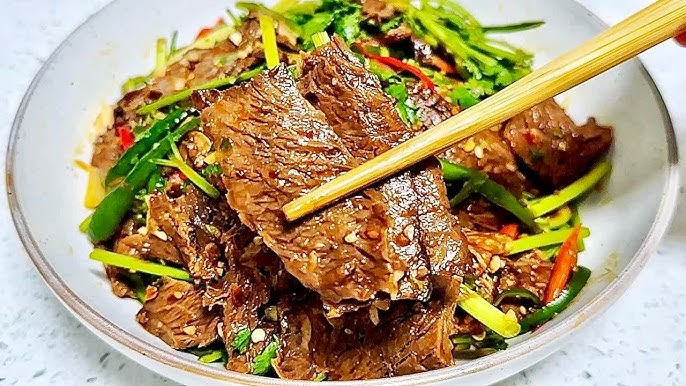

# 凉拌牛肉的做法

预估烹饪难度：★★★

预估卡路里：765 大卡

## 必备原料和工具

- 牛里脊&吊龙
- 香菜、黄瓜
- 生姜水
- 蒜末

## 操作

1. 横切牛肉（1个硬币厚），加入盐少量、生姜水，蚝油抓匀抓出粘性，再加入玉米淀粉上浆，最后加入适量食用油封油。
2. 黄瓜拍碎切小块，加一勺盐杀出水分，倒出水分，备用。
3. 香菜切碎，备用
4. 碗中加上蒜末、小米辣、白芝麻、辣椒面、再浇上热油激出香味，再加上盐、味精、白糖、生抽、陈醋、花椒油、芝麻香油拌匀，备用
5. 锅中水烧开，小火，牛肉一点点散开下锅，中火，撇出浮沫，2分钟捞出
6. 将牛肉、黄瓜、香菜、料汁拌匀即可

## 附加内容

洋葱炒牛肉做法同上
