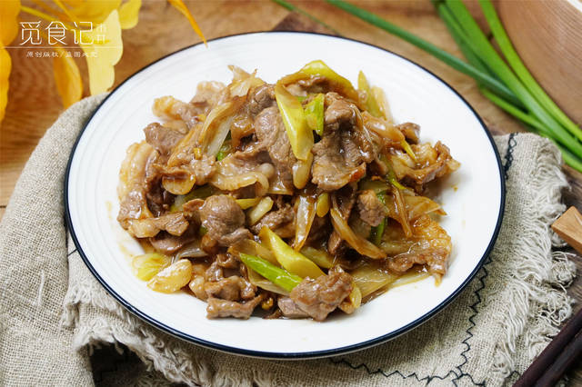

# 葱爆羊肉的做法

葱爆羊肉是一道经典的传统京菜，以肉质鲜嫩、葱香浓郁、鲜香不膻见。制作核心在于“急火快炒”，利用高温锁住肉汁，并用大量大葱去除羊肉膻味。

预估烹饪难度：★★★

预估卡路里：1565 大卡

## 必备原料和工具

- 羊里脊或羊腿肉
- 大葱
- 葱姜水

## 操作

1. 横切羊肉（1个硬币厚），加入胡椒粉、盐少量、生抽、葱姜水，抓匀，再加入玉米淀粉抓匀，再加入适量食用油封油。
2. 大葱切滚刀段
3. 锅热倒入少量油，形成油膜。再加凉油后倒入肉片，定型变色再翻炒
4. 肉片表面淀粉糊化后扒拉到锅一侧，另一侧加入大葱，大葱炒软后翻炒至肉片变色，关小火
5. 加入生抽，老抽，盐大火翻炒均匀，淋醋和香油，即可出锅

## 附加内容

出锅前可以根据口味添加蒜末

