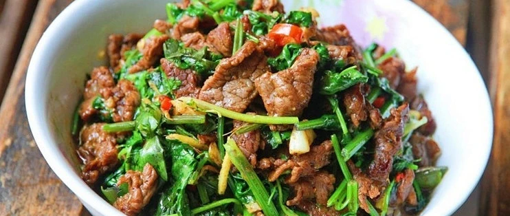

# 香菜牛肉的做法

预估烹饪难度：★★★

预估卡路里：1265 大卡

## 必备原料和工具

- 牛里脊&吊龙
- 香菜
- 彩椒（可选）
- 生姜水
- 姜蒜片

## 操作

1. 横切牛肉（1个硬币厚），加入盐少量、生姜水，抓匀抓出粘性，再加入玉米淀粉上浆，最后加入适量食用油封油。
2. 香菜切段，备用。
3. 锅热倒入使用油，形成油膜，中火，倒入肉片定型变色再翻炒至变色立刻盛出备用
4. 锅中加油，放姜蒜片煸香，大火，香菜下锅，断生关小火
5. 加入盐、白糖、味精、生抽，大火翻炒均匀，再倒入牛肉，翻炒一下即可出锅

## 附加内容

洋葱炒牛肉做法同上
